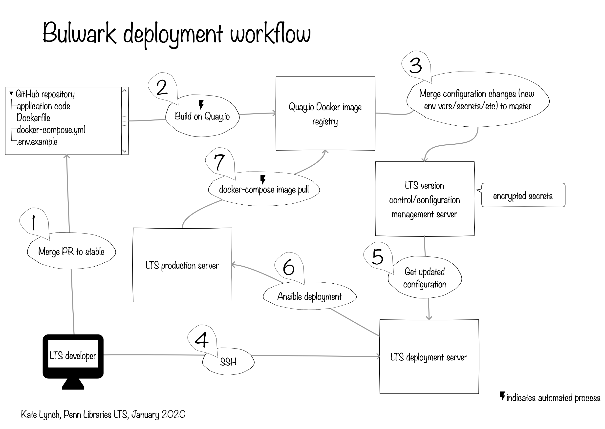

# README for `bulwark`

Bulwark is a Hydra head providing administrative digital asset and metadata generation, management, review, and ingest to a repository with a public facing capability.

## System dependencies

* [Git](https://git-scm.com/) - The application supports robust versioning of content and metadata through the use of git for version control.
* [Git-annex](git-annex.branchable.com) - A git library that allows large binaries to be safely and robustly managed by git without being checked into the git repository.
* [xsltproc](http://xmlsoft.org/XSLT/xsltproc.html) - Command-line XSLT processor for transforming base XML into other formats for ingest/review.
* [ImageMagick](http://www.imagemagick.org/script/index.php) - Software suite for creating and editing binary images, relied upon by the [minimagick](https://github.com/minimagick/minimagick) gem, used to create image derivatives.
* [NPM](https://www.npmjs.com/)

## Setting up local development and test environment
We are using [lando](https://docs.lando.dev/basics/) to set up our local development and test environments. We have some custom rake tasks that wrap lando commands and run other necessary tasks.

### Installing system requirements

#### Mac (installing via homebrew)  
```
brew install git-annex
brew install imagemagick
brew cask install lando
```

#### Linux  
See the [lando website](https://docs.lando.dev/basics/installation.html#linux) for installation options
```
sudo apt-get install imagemagick git-annex
```  

### Running Services in Development

#### Starting
  ```
  rake bulwark:start
  rails s
  ```

#### Stopping
  ```
  rake bulwark:stop
  ```

#### Starting Fresh
  ```
  rake bulwark:clean
  rake bulwark:start
  ```

### Adding Data

#### To add administrative user
  ```
  rake bulwark:setup:create_admin
  ```

#### To add digital object and administrative user
  ```
  rake bulwark:setup:create_digital_object
  ```

## Configuration Files

#### filesystem.yml
This configuration file specifies semantic information about the filesystem and filesystem behaviors that the application will use for asset lookup.

Run the following command from within your application's root directory:
```bash
cp config/file_extensions.yml.example config/file_extensions.yml
```
An environment block for successfully deploying the application should look like the following:
```yaml
development:
  assets_path: /absolute/path/on/fs
  assets_display_path: /absolute/path/on/fs
  file_path_label: FILE_PATH
  metadata_path_label: METADATA_PATH
  manifest_location: /absolute/path/on/fs/admin/manifest.txt
  object_data_path: directory_name
  object_admin_path: directory_name
  object_derivatives_path: directory_name
  object_semantics_location: filename_no_extension
  repository_prefix: PREFIX
  working_dir: /absolute/path/on/fs
  transformed_dir: /absolute/path/on/fs
```

Edit the config file to reflect your local settings for the fields as follows:  
* `assets_path` - The location on the filesystem where the application will maintain preservation-worthy files.
* `assets_display_path` - The location on the filesystem where the application will handle serving display-worthy derivatives.
* `file_path_label` - A value used by the application to populate the semantic manifest.  This can be customized, or left FILE_PATH by default.
* `metadata_path_label` - A value used by the application to populate the semantic manifest.  This can be customized, or left METADATA_PATH by default.
* `manifest_location` - The location on the filesystem where a manifest containing minimal semantic information for the application to begin populating its own semantic knowledge base is stored.  See area below for configuration details of this file.
* `object_data_path` - The directory within the git repository for each object where the user will be directed to interact on their local filesystem.
* `object_admin_path` - The directory within the git repository for each object where the application will be directed to interact.
* `object_derivatives_path` - The directory within the git repository for each object where the application will be directed to store binary derivatives.
* `object_semantics_location` - The filename (no extension) within the git repository for each object where the application will store and be directed to find semantic information about the structure of the git repository.
* `repository_prefix` - String prefix used to form identifiers in Fedora (possibly to be deprecated).
* `working_dir` - Absolute path on the file system where the application will clone git repositories for objects and perform operations on the content.
* `transformed_dir` - Absolute path on the file system where the application will look for transformed XML files.  NOTE: This should be different from the `working_dir` location.

#### file_extensions.yml
This configuration file specifies which file types will be accepted as digital assets by the application, and which file types will be accepted as potential metadata sources, based on their extensions.
Run the following command from within your application's root directory:
```bash
cp config/file_extensions.yml.example config/file_extensions.yml
```

An example of a successfully configured environment block in the application should look like the following:

```bash
development:
  allowed_extensions:
    assets: "jpg,jp2,tif,tiff"
    metadata_sources: "xlsx"
```

#### manifest.txt
Below is an example of the manifest file that the application uses to populate its semantic knowledge base of where git repositories are stored, which in turn contain additional semantic information.  This file should be a flat text file.  Its full path on the filesystem, including filename and extension, must be reflected accurately in the value of `manifest_location` in `filesystem.yml` in order for the application to function.

An example of contents should look like the following:
```bash
assets_path: /absolute/path/on/fs
email: name@organization.org
```

* `assets_path` - This is the absolute path on the filesystem where the preservation-worthy git repositories are stored.  
* `email` - An email address that can be used to communicate semantic errors, preservation concerns, dead ends, etc to a human.  This should be an email that the application developer/owner has access to.

## Rubocop
To recreate .rubocop_todo.yml use the following command:
`rake bulwark:rubocop:create_todo`

## Deployment workflow

This illustration represents the current deployment workflow for Bulwark.



## Contributing

Bug reports and pull requests are welcome on GitHub at [https://github.com/upenn-libraries/bulwark](https://github.com/upenn-libraries/bulwark).

## License

This code is available as open source under the terms of the [Apache 2.0 License](https://opensource.org/licenses/Apache-2.0).

## Acknowledgments

This software is brought to you by the Samvera community.  Learn more at the
[Samvera website](http://samvera.org/).


